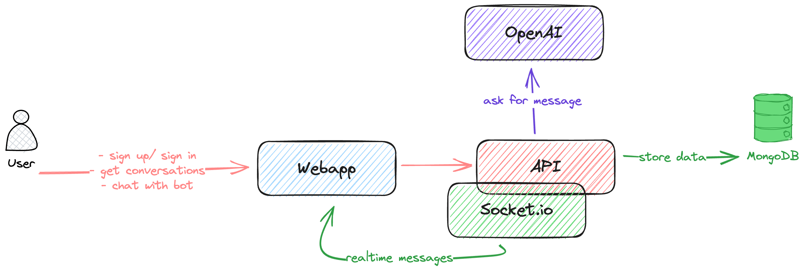
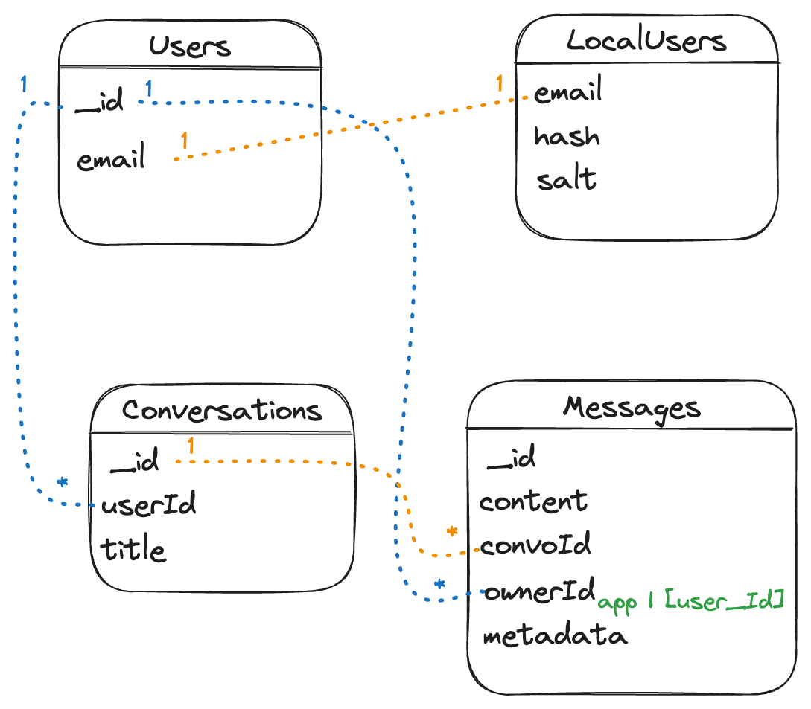
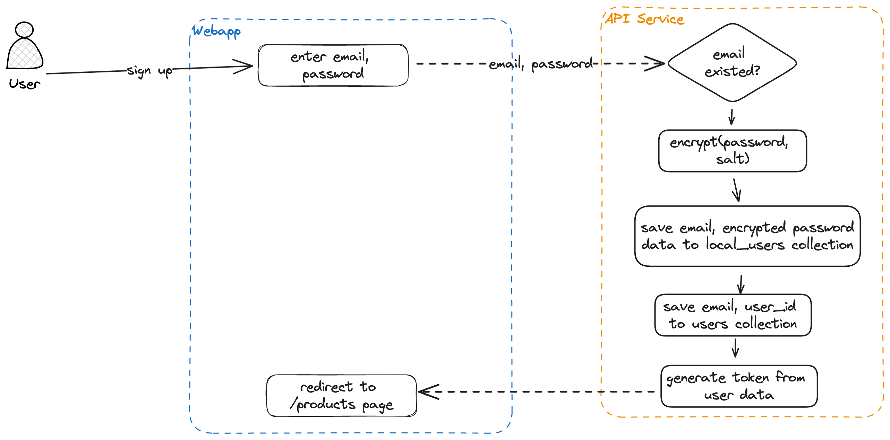
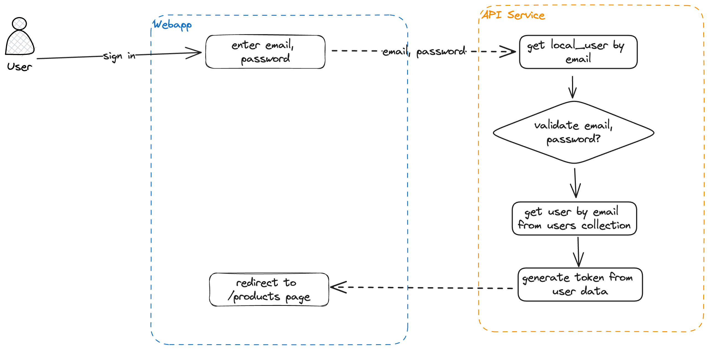
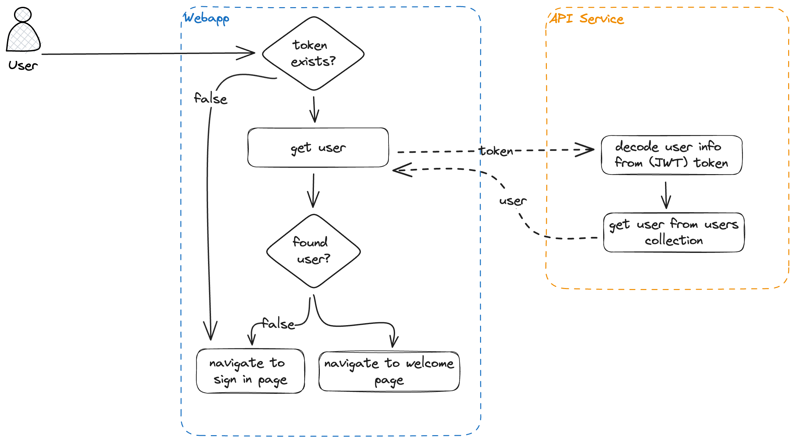
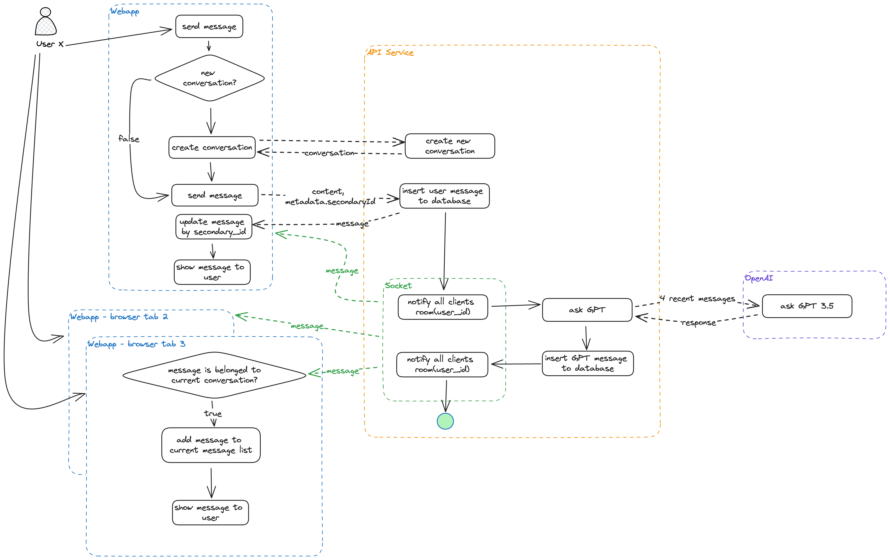

# YASITAN - Your GPT Assistant Application

Welcome to **YASITAN**, a GPT Assistant application where users can ask about anything in the world.

Check out our [Demo](https://youtu.be/IlPzuUBEqHs).

## Solutions
### System Overview


*System Overview Diagram*

This application is designed using a microservices architecture and consists of the following services:

- **Webapp Service**: This is where users interact with our application.
- **API Service**: Responsible for authentication and management of conversations and message logic.
- **MongoDB**: The database used to store all data in our application.

### Database


*Database Diagram*

The database consists of the following collections:

- **Users Collection**: Stores all user information.
- **LocalUsers Collection**: Stores user credential information separately from the main Users Collection.
- **Conversations Collection**: Stores conversation data.
- **Messages Collection**: Stores message data. The `metadata` field contains additional data for the message, such as the `secondaryId` used to link interactions between the Frontend and Backend, as shown in the flow chart below.

### Authentication & User Diagrams


*Register New Account*
<br>
<br>


*Sign In*
<br>
<br>


*Revisit App*
<br>
<br>

### Chat with GPT chatbot Diagrams


*Chat with GPT chatbot*
<br>
<br>

**Block Explanation:**
- **Update message by secondary_id:** We will base on this id for matching the message that is just sending right before. That's used to avoid duplicating when receiving message from websocket via Socket.io

## Installation

### 1️⃣ Clone the repository

```shell
git clone git@github.com:haile-vnm/yasitan.git yasitan
```

### 2️⃣ Set up Environment

- Create a `.env` file from `.env.example`. (Modify the values in the `.env` file according to your preferences (not recommended, as values are set for test running)).
- Create a `apps/webapp/.env.local` file from `apps/webapp/.env.local.sample`.

### 3️⃣ Build and run Docker containers

```shell
docker compose up -d
```

Running this command starts all required services.

## Test the Application
### By using Web 🚀

After successfully building the mentioned services, you can access the following endpoints:

- Webapp Endpoint: [http://localhost:3000](http://localhost:3000)
- API Endpoint: [http://localhost:3100](http://localhost:3100)

### Using API
- Install `Rest Client` vscode extension
- Switch Rest Client env to `api.local`
- Create .env file in the `.rest-client` folder, and replace your value for each variables
- Open and click at any endpoint in the `.rest-client/api.http` file for testing the endpoint.

For more detail how to use this extension, please follow its docs at [here](https://github.com/Huachao/vscode-restclient)

Enjoy every moment! 💃🕺

Thank you! 🥳🥳🥳
